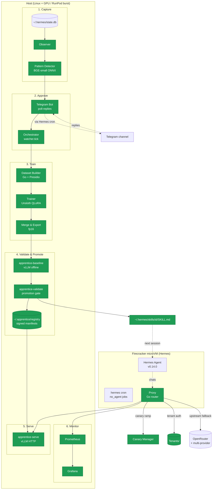

# Apprentice — specialist training infrastructure for Hermes (v0.2)

Hermes Agent has skills — Markdown files that tell it how to handle a request.
**Apprentice** adds a second loop: when Hermes has seen a pattern enough times,
Apprentice grabs the `(user-input, big-model-output)` pairs, fine-tunes a little
Qwen2.5-1.5B on them with Unsloth QLoRA, validates the result against a held-out
test set, and registers it as a specialist that routes future matches to a free
local endpoint.

Skills are prompts. **Apprentice turns some of them into weights.**

[](https://dev.to/challenges/hermes-agent-2026-05-15)
[](LICENSE)
[](orchestrator/)
[](proxy/)


## Architecture



## v0.2 Feature Highlights

| Feature | Description |
|---------|-------------|
| **Canary Ramp** | Specialist rollouts start at 5% traffic, auto-advance to 100% as agreement scores prove safe. Broken specialists are quarantined automatically. |
| **Multi-Base-Model** | Train on Qwen2.5-1.5B (default), Qwen2.5-3B, or Llama-3.2-3B. User-editable `supported_models.yaml`. |
| **Pattern Merging** | Combine two specialists into one. MCP `propose_merge` → Telegram approval → merged dataset → regression gate. |
| **Multi-Tenant** | `X-Apprentice-Tenant` header + API key auth. Per-tenant rate limiting, quota management, global patterns. |
| **Monthly Budget** | Monetary budget with Telegram alerts at 80%/95%/100% thresholds. On-demand increase via `budget increase $N` reply. |
| **Grafana Dashboards** | 8-panel dashboard: request rate, latency p50/p95/p99, error rate, cost saved, top patterns, specialist-vs-upstream latency, status pie, 24h counters. |
| **RunPod Burst** | Cloud training on A100/A6000/L40S. GPU type auto-selection, budget-gated provisioning. |
| **Multi-Provider Upstream** | OpenRouter primary, Fireworks/MiniMax/Together as fallback tiers. |

## How a request flows

1. Hermes' chat endpoint points at the local **Proxy** (`:8083/v1/chat/completions`).
2. **Auth**: If `--tenant-root` is set, `X-Apprentice-Tenant` + `X-Apprentice-Key` headers are validated against per-tenant API keys.
3. **Rate check**: Per-tenant token bucket enforced if `--tenant-ratelimit-rpm` is set.
4. **Embed**: Last user message embedded with BGE-small ONNX (384-dim, L2-normalized).
5. **Match**: Cosine similarity against registered pattern centroids, scoped to tenant + global.
6. **Alias resolution**: Pattern ID may be aliased (for merged patterns).
7. **Canary check**: Warming patterns route probabilistically (5%→100%), broken patterns are quarantined.
8. **Route**: Match → local specialist (free, ~38ms). No match → upstream fallback (OpenRouter, paid).
9. **Shadow**: 5% of matched requests also hit upstream for offline quality comparison.
10. **Log**: Structured JSON log line with route_decision, pattern_id, latency, token counts, cost.

Every routed turn emits a structured JSON log line. Prometheus counters at `/metrics` (Grafana dashboards pre-built). Rolling p50/p99 at `/stats`. Canary state at `/canary/state`.

## Repo layout

```
hermes-apprentice/
├── observer/             — Go    Tails ~/.hermes/state.db, normalises pairs
├── detector/             — Go    BGE-small ONNX → HDBSCAN → candidate patterns
├── dataset-builder/      — Go    Fetches pairs, redacts PII, splits 80/10/10, merge tool
├── trainer/              — Py    Unsloth QLoRA + manifest signer + multi-base-model
├── validator/            — Py    Baseline runner + promotion gate + registry + merge regression
├── serving/              — Py    vLLM HTTP server + residency control plane
├── proxy/                — Go    OpenAI-compat router with canary/tenants/ratelimit/aliases/cost
├── registry-service/     — Go    Read-only HTTP over ~/.apprentice/registry/
├── orchestrator/         — Py    Autonomous pipeline driver + MCP tools + budget/quota/safety
├── telegram/             — Py    Templates + outbox + getUpdates reply poller
├── installer/            — Py    Interactive setup: detect host, build venvs + Go, write .env
├── burst/                — Go    RunPod A100 spot dispatcher (signed jobs)
├── deploy/               — YAML  Docker compose, Grafana dashboards, Prometheus config
├── scripts/              — Sh    Demo script, helper utilities
├── tasks/                — JSON  73-subtask tracker
├── notes/                — Md    Research, integration runbooks, verification docs
└── docs/                 — Md    Feasibility plan, benchmarks, migration guides
```

## Quickstart

### Prerequisites

- Linux host with KVM and tun/tap (for Firecracker)
- Go 1.26+, Python 3.10+, `uv` (Astral), Docker (for Presidio sidecar)
- NVIDIA GPU for training (2080 Ti 11GB suffices) **or** RunPod account for cloud burst
- Telegram bot token + chat ID (optional, for notifications)

### One-time setup

Apprentice runs alongside Hermes. Pick your isolation profile:

```bash
# Firecracker (bare-metal KVM, strongest isolation)
bash .firecracker/bootstrap.sh
.firecracker/vm.sh start

# Docker (portable, works in VMs)
docker compose -f deploy/docker/docker-compose.yml up -d

# None (raw install — drop into an existing Hermes, no isolation)
# Your Hermes should already be running on the host.

# All-in-one installer (detects GPU, recommends profile, builds Go + Python, writes .env)
apprentice-setup --apply

# Explicit profile:
apprentice-setup --apply --profile none    # raw, alongside existing Hermes
apprentice-setup --apply --profile docker  # Docker containerized

# With flags for scripting / CI:
apprentice-setup --apply --non-interactive \\
    --telegram-token "$BOT_TOKEN" --telegram-chat-id "$CHAT_ID" \\
    --openrouter-key "$OPENROUTER_KEY" --base-model qwen2.5-1.5b \\
    --monthly-budget 20 --enable-monitoring
```

1. Detects the host (GPU / KVM / Docker / uv) and recommends an isolation profile.
2. Collects Telegram, OpenRouter, and RunPod API keys (optional — skippable).
3. Sets up your base model (Qwen2.5-1.5B, Qwen2.5-3B, or Llama-3.2-3B).
4. Configures a monthly cloud budget (default $20; 0 = local-only).
5. Builds Go binaries (proxy, dataset-builder, registry-service, burst) into `~/.apprentice/bin/`.
6. Reproduces two uv venvs from lockfiles (`venv-train`, `venv-serve`).
7. Prints cron lines to register with your scheduler.
8. Optional: starts Prometheus + Grafana via Docker (`--enable-monitoring`).

Dry-run by default (omit `--apply` to preview the install plan). All settings persist in `~/.apprentice/.env` — re-running only updates what you provide.

**Manual alternative (if you prefer step-by-step control):**

```bash
# Host Python packages
for pkg in trainer validator serving telegram orchestrator installer; do
  ( cd "$pkg" && uv pip install -e . )
done

# Host Go binaries
for pkg in observer detector dataset-builder proxy registry-service burst; do
  ( cd "$pkg" && go build ./... && go install ./... )
done

# Apprentice trainer key (used to sign manifests)
apprentice-trainer-keygen ~/.apprentice/keys
```

### Demo (single command)

```bash
bash scripts/demo-run.sh
```

Reproducible end-to-end: seeds a session log → detection → pipeline → promotion → serving → test request → dashboard URL + summary.

### Drive the pipeline

```bash
# 1. Capture
observer serve --listen :8081 --hermes-db ~/.hermes/state.db &
detector serve --listen :8082 --observer-url http://localhost:8081 &

# 2. Build dataset
dataset-builder build --pattern-id <id> --observer-url http://localhost:8081

# 3. Train + merge + validate (orchestrator runs all)
apprentice-orchestrator tick

# 4. Serve
apprentice-serve --model-dir ~/.apprentice/registry/<id>/latest/ --port 8000 &

# 5. Proxy
proxy serve --listen :8083 \
  --upstream-url https://openrouter.ai/api/v1 \
  --tenant-root ~/.apprentice/tenants \
  --tenant-ratelimit-rpm 60

# Point Hermes: http://__HOST_IP__:8083/v1/chat/completions
```

### Telegram (optional)

```bash
# Enqueue graduation message
apprentice-telegram enqueue graduation --pattern-id <id> \
    --record-count 42 --description "Extract SKU + qty from order emails."

# Register Hermes cron jobs
scp telegram/scripts/apprentice-telegram-*.sh root@GUEST:/root/.hermes/scripts/
ssh root@GUEST 'hermes cron create --name apprentice-telegram --no-agent \
    --script apprentice-telegram-dispatch.sh --deliver telegram "every 5m"'
ssh root@GUEST 'hermes cron create --name apprentice-poll-replies --no-agent \
    --script apprentice-telegram-poll.sh "every 1m"'
```

Reply commands: `train gc-abcd1234`, `skip gc-abcd1234`, `details gc-abcd1234`, `budget increase 10`.

### Multi-tenant setup

# Register tenants

apprentice-orchestrator quota set --tenant acme --max-loras 5

apprentice-orchestrator budget set --tenant acme --monthly 100

# Start proxy with auth (CLI uses "tenant" for the concept)

proxy serve --tenant-root ~/.apprentice/tenants --global-api-key "admin-secret"

# Each tenant gets a unique key

curl -H "X-Apprentice-Tenant: acme" -H "X-Apprentice-Key: &lt;tenant-key&gt;" ...
```

### Monitoring

```bash
docker compose -f deploy/docker/compose.monitoring.yml up -d
# Grafana: http://localhost:3000 (anonymous viewer)
# Prometheus: http://localhost:9090
```

## Status

| Milestone | Subtasks | Done |
|---|---|---|
| foundation | 8 | 8 |
| observer | 6 | 6 |
| detector | 7 | 7 |
| dataset-builder | 9 | 9 |
| trainer | 8 | 8 |
| serving | 5 | 5 |
| validator | 8 | 8 |
| proxy | 9 | 9 |
| skill | 5 | 5 |
| instrumentation | 4 | 4 |
| telegram | 6 | 6 |
| **v0.2 features** | — | **all** |
| demo | 7 | 2 (README + script) |

## Design choices

- **Hermes lives in a microVM.** Skill files get scp'd in. It never runs on the host.
- **The proxy routes deterministically.** Cosine matching on BGE-small embeddings. The SKILL.md is for ecosystem visibility, not routing.
- **Baseline is split from validate.** Two separate CLIs with a file seam between them — so the base model and specialist never share a GPU.
- **Telegram rides Hermes' cron adapter.** No python-telegram-bot on the host.
- **Every manifest is signed.** Training and registry manifests use Ed25519 key pairs.
- **Canary is self-correcting.** Warming→live as agreement stays above threshold. Warming→broken if it drops.
- **Merging requires operator approval.** MCP proposal → Telegram confirmation → regression gate against both parents.
- **Budget gates cloud spend.** 80% warning, 95% pause, 100% block. Increase only via Telegram `budget increase`.

## Known gaps

- **No true multimodal** — text-only multi-base-model for v0.2. Image/audio specialist training deferred.
- **Single GPU serialization** — orchestrator processes one training job per tick. Multi-GPU scheduling not implemented.
- **Firecracker-only Hermes** — Docker Compose deployment available but not the default path.
- **OpenRouter live verification pending** — E2E tested against mocks. See `notes/openrouter-live-verification.md`.
- **Python 3.14 untested in CI** — pyproject constraints relaxed but no automated testing for 3.14 yet.

## Testing

```bash
make test          # Go + Python
make coverage      # Go + Python coverage reports
make lint          # go vet
```

Go: `go test ./...` in proxy, dataset-builder, registry-service, burst.
Python: `pytest tests/` in orchestrator, trainer, validator, serving, telegram.

## License

Apache 2.0. Qwen2.5-1.5B-Instruct is Apache 2.0 too — clean for portfolio and contest submission.
